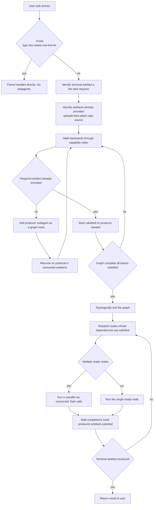

# Subagent Orchestration

This skill is the parent agent's runbook for working with subagents registered under `~/.cursor/agents/` (and `<workspace>/.cursor/agents/` if present). It is **not** a workflow template. It is a procedure for constructing a per-task dependency graph from each agent's declared capabilities and dispatching the graph correctly.

Two non-negotiables sit at the top because they are the two failure modes this skill exists to prevent:

1. **Never invent answers to subagent checkpoint questions.** If a subagent emits a `cursor-checkpoint` block, the parent must relay it to the user via `AskQuestion` before any other tool call. The verbatim question and options text. No paraphrasing. No silent defaults. (See §6 Relay protocol.)
2. **Never consult a fixed pipeline diagram.** The parent does not say "this is a new feature, so the order is PM → Principal → Staff → SWE → DevOps." The parent runs §4 Dependency-graph procedure for every task and lets the actual dependencies pick the order. (See §3 Artefact vocabulary and §4 Dependency-graph procedure.)

## When to use this skill

Trigger on any of:

- The user gives a coding task that is non-trivial (anything beyond a typo, comment, doc tweak, or one-line lint fix).
- The user gives a design, architecture, refactor, audit, security review, performance review, or planning task.
- The user attaches a PRD, plan, architecture doc, or other artefact and asks for downstream work.
- The user explicitly invokes a subagent by name (e.g. `@staff-engineer`, `/dev-ops`) — even then, run the procedure to confirm the chosen agent fits the task and to discover any companion agents the work needs.

Skip when the task is trivially in scope of the parent agent and has no design, planning, or multi-step delivery component (typo, doc tweak, single-token rename, single-line config change). The parent handles those directly.

## §1 Marker contract — the `cursor-checkpoint` block

Every subagent that wants human-in-the-loop relay emits a fenced code block with info-string `cursor-checkpoint` at every checkpoint return. The parent (and the `subagentStop` hook at `~/.cursor/hooks/relay-subagent-checkpoint.sh`) recognise this block and trigger relay.

Schema:

````
```cursor-checkpoint
kind: question                      # "question" or "blocked"; reserved: "approval"
agent: staff-engineer               # subagent id (matches the agent's filename + frontmatter `name`)
checkpoint: A                       # checkpoint id from the subagent's HITL protocol — A, B, …
question: |
  The full question text the parent will pass to AskQuestion verbatim.
  Multi-line is fine; YAML block scalar preserves it.
options:
  - id: brownfield
    label: Extend existing provider-registry module
    tradeoff: lowest reuse cost; risk of broadening the registry's responsibility
  - id: parallel
    label: New parallel module
    tradeoff: clearer SRP; new test surface and wiring root
default: brownfield                 # one of the option ids above
```
````

Field semantics:

- `kind` (string, enum) — `question` (a decision fork mid-authoring) or `blocked` (execution blocker after the retry budget — see below). `approval` is reserved; treat unknown kinds as `question` defensively.
- `agent` (string) — the subagent's id, matching the filename of `~/.cursor/agents/<id>.md` and its frontmatter `name`. Used in the relay instruction so the parent passes `subagent_type=<agent>` on resume.
- `checkpoint` (string) — the checkpoint label from the subagent's own HITL protocol (`A`, `B`, …). Echoed in the relay instruction for context.
- `question` (string, YAML block scalar) — the full question text. The parent passes this **verbatim** as the AskQuestion `prompt`. No paraphrasing.
- `options` (list of `{id, label, tradeoff}`) — the option set. Each becomes one option in the AskQuestion call. The `tradeoff` is shown to the user inline so they understand what each choice gives up.
- `default` (string) — the recommended default option id. Surfaced to the user as a recommendation but does NOT skip the AskQuestion call. The user always answers explicitly.

Hard rules around the marker:

- The block appears **only** on a checkpoint return, not on terminal output. Terminal output ends with the deliverable, no marker. This separates "I am pausing for input" from "I am done."
- One block per return. If a subagent has multiple questions, it emits one block per checkpoint cycle (the parent relays, resumes, the subagent advances and may emit another block at the next checkpoint).
- The block is plain YAML inside a fenced code block whose info-string is exactly `cursor-checkpoint`. Variants (`checkpoint`, `cursor_checkpoint`) are not recognised.

### `kind: blocked` — execution-blocker escalation

`kind: blocked` is the sanctioned alternative to spinning when a subagent's tooling fails. Per `~/.cursor/rules/execution-time-discipline.mdc`, a subagent that exhausts its retry budget (max 2 changed-hypothesis retries per failing command / tool call) emits a `blocked` block instead of re-trying, re-waiting, or idling. Field usage:

- `question` — states **what was attempted** (the exact commands / tool calls), **the captured error or hang evidence** (output excerpt, exit code, kill-after-timeout), and what the subagent needs to proceed.
- `options` — 2–3 concrete recovery options, e.g. *retry with change X* (name the change), *switch tool / approach Y*, *skip this step and accept the stated gap*. Each option carries its `tradeoff`.
- `default` — the recovery the subagent recommends.

The parent relays a `blocked` block exactly like a `question` block — `AskQuestion` verbatim, then `Task(resume=…)` with the user's chosen recovery. The relay hook needs no per-kind logic; the marker's presence is the trigger. A `blocked` return is never a completion: the artefact stays `in-progress` and the subagent's `produces` stays unsatisfied until it resumes and terminates normally.

## §2 Discovery procedure

The first step of every non-trivial delegation. Builds the capability index from the live filesystem state. The roster is a runtime input — never hard-code subagent names anywhere except inside the agent files themselves.

1. **List registered subagent files.** Glob `~/.cursor/agents/*.md` and `<workspace>/.cursor/agents/*.md` (if the current workspace has a `.cursor/agents/` directory). Cursor's built-in subagent types (`generalPurpose`, `explore`, `shell`, `browser-use`, `cursor-guide`, `best-of-n-runner`, `dev-ops` once registered, etc.) are also available via the `Task` tool's `subagent_type` parameter; the parent already knows their descriptors from the system prompt.
2. **Read each agent's frontmatter.** Three fields drive orchestration:
   - `name` (string) — the agent id passed as `subagent_type` on `Task` calls.
   - `produces` (list of artefact-type IDs) — what the agent outputs. Used to find producers for required artefacts.
   - `consumes` (list of artefact-type IDs) — what the agent needs as inputs. Used to recurse the dependency walk.
   - The free-text `description` is for human readability and tiebreakers when multiple agents declare overlapping `produces`.
3. **Build the capability index.** A bidirectional map:
   - artefact-type → {agents that produce it}
   - agent → {artefact-types it consumes}
4. **Cache the index for this delegation only.** The next user task triggers a fresh discovery pass — the roster may have changed.

## §2.5 External-context MCP discovery

The parent agent's first pass on every non-trivial task also runs the external-context discovery procedure in `~/.cursor/skills/external-context-discovery/SKILL.md`. This is a sibling discovery to §2 — §2 enumerates the **subagent** roster, §2.5 enumerates the **MCP** roster — and the result feeds the same "what is already available?" question that §4 asks.

- **Both rosters are runtime inputs.** Just as §2 forbids hard-coded subagent names, §2.5 forbids hard-coded MCP server names. The parent matches the task's information needs to capability classes inferred from each MCP tool's `description` field at runtime, never from a closed list of servers.
- **MCP-fetchable context is the third "already-provided" input** alongside (a) attached files and (b) repo source. The parent considers it during §4 step 3 — see the updated bullet list in §3 below. A `prd` may be partially satisfied by an existing ticket / document; an `architecture-doc` by a Confluence-style ADR; a `bug-diagnosis` by an existing observability dashboard. When the artefact is **fully** satisfied by an MCP read, the corresponding subagent is skipped exactly the same way as if the user had attached the file.
- **Discovery is hierarchical, not pipelined.** The parent does its MCP discovery for parent-level orchestration questions (what's already-provided, which subagents to dispatch). Each dispatched subagent **also** runs the same skill, scoped to its own information needs. The parent does not pre-fetch and pipe; subagents fetch what they need themselves. The one exception is `claude-code` (see its agent file §2.3), which must pre-fetch and bake findings into the prose brief because Claude Code itself does not see Cursor MCPs.
- **No new artefact types.** MCP-fetched data flows into the existing artefact vocabulary in §3 (a fetched ticket becomes part of the `prd`'s sources; a fetched dashboard becomes part of the `architecture-doc`'s drivers); it is not its own artefact type.
- **Write-class MCP calls go through the relay.** Creating a ticket, posting a comment, modifying a design, mutating a dashboard, deploying — every write requires `AskQuestion` (parent) or a fresh `cursor-checkpoint` (subagent) per `~/.cursor/rules/ask-dont-assume.mdc`. The marker contract in §1 covers this trivially; the parent treats write-class MCP requests from subagents exactly like any other checkpoint.

## §3 Artefact vocabulary

The shared type system that `produces`/`consumes` declarations align against. This is the canonical list; subagent frontmatter may only reference IDs in this table.

| Artefact type | Description | Typical producer (today) | Typical consumer (today) |
| --- | --- | --- | --- |
| `business-prompt` | Raw user ask in natural language | the user (always supplied at the start of a session) | `product-manager` |
| `prd` | Product requirements doc with FR / NFR IDs, acceptance criteria, edge cases | `product-manager` | `principal-engineer`, `staff-engineer` |
| `architecture-doc` | System architecture + ADRs + atomicity / failure model | `principal-engineer` | `staff-engineer` |
| `lld-plan` | Module decomposition + schema + sequenced waves (no code) | `staff-engineer` | `software-engineer`, `dev-ops` |
| `code-diff` | Production code + tests | `software-engineer` | `dev-ops`, future review agents |
| `deploy-artefact` | Dockerfile / workflow / IaC / package-manager scripts | `dev-ops` | (terminal — consumed by humans / CI) |
| `review-report` | Audit findings (code review, security audit, performance audit, accessibility audit, etc.) | future review agents | (terminal, OR feeds back upstream as input for a revision) |
| `bug-diagnosis` | Root-cause analysis with reproduction + fix sketch | parent itself, or a future debugger agent | `software-engineer`, `staff-engineer` |
| `test-plan` | Layered, requirement-traceable test strategy (levels, gates, tooling, environments) incl. test-data (golden + prod-like), manual-vs-automated split, and test-infrastructure / environment setup | `qa-engineer` | `qa-engineer` (self, execution phase), humans |
| `qa-report` | Test execution results + structured defect / bug log (each defect routed to a responsible subagent) + ship verdict mapped to AC IDs | `qa-engineer` | feeds back to `software-engineer` / `staff-engineer` / `dev-ops` (routed fix loop); terminal for humans |
| `ux-research` | UX research findings: problem framing, personas, JTBD alignment, competitive / heuristic analysis, user flows, information architecture, accessibility requirements | `ux-designer` | `ux-designer` (self, design phase), `staff-engineer`, humans |
| `ux-design-spec` | UI/UX design spec: design system / tokens, component + screen specs, responsive + accessibility annotations, and references to the design files (e.g. Figma frames) created via MCP | `ux-designer` | `staff-engineer` / `software-engineer` (frontend), humans |
| `research-brief` | AI research brief: SOTA survey with dated citations + critically-appraised benchmarks + a compared-alternatives recommendation matrix with epistemic-status labels | `ai-researcher` | `ai-engineer` / `principal-engineer` / `staff-engineer` (conditional, when the task has an AI/ML surface), humans |

Rules for this vocabulary:

- The vocabulary is a working set, not a closed taxonomy. New artefact types may be added — but only via a deliberate edit to this table when a new subagent is onboarded that needs them. See §8 Onboarding.
- The parent must NOT invent new artefact-type IDs at runtime. If the user's terminal artefact does not fit any existing type, the parent surfaces the gap via `AskQuestion` rather than guessing.
- An "artefact already provided" check (used in the dependency walk) recognises any of: a file uploaded in chat, a path the user mentions in their prompt, a `*.plan.md` file under `.cursor/plans/` or a sibling location for the relevant artefact type, the existing repo source for `code-diff`, a prior subagent's terminal output during the same task, **or a read-only MCP fetch that returns the artefact content** (e.g., an existing ticket / document / page that already contains the PRD; an existing observability dashboard that already encodes the SLA target; an existing API spec that already describes the contract). MCP discovery is run per §2.5 as part of the parent's first pass on the task.

## §4 Dependency-graph procedure

The parent runs this procedure for every non-trivial task. Same procedure for every task; different tasks produce different graphs.



Step-by-step:

1. **Trivial check.** If the task is a typo, doc tweak, comment, single-line lint fix, single-token rename, or trivial config change with no design or planning component → parent handles directly, no subagents, no procedure. End.
2. **Identify the terminal artefact(s).** Read the user's task. What does the user actually want as the deliverable? Common endings:
   - "Implement / build / write the code for X" → `code-diff`.
   - "Build and deploy X" → `code-diff` + `deploy-artefact`.
   - "Design X" → `architecture-doc` (if system-level) or `lld-plan` (if module-level).
   - "Write the PRD / requirements for X" → `prd`.
   - "Audit / review X" → `review-report` (one or more).
   - "Diagnose / fix this bug" → `code-diff` (preceded by `bug-diagnosis` if root-cause is non-obvious).
   - "Test / QA / verify X" → `test-plan` + `qa-report` (`qa-engineer` consuming the existing `code-diff` plus the `prd` / `lld-plan` for traceability).
   - "Design the UI/UX for X" → `ux-research` + `ux-design-spec` (`ux-designer` consuming the `prd`). Note: `ux-design-spec` is a **conditional** input to implementation — when a task has a UI / frontend surface, the parent adds `ux-designer` as a parallel producer (alongside `principal-engineer`) and feeds its spec into the UI `lld-plan` / frontend `code-diff`. It is not a hard dependency for non-UI code work, so it does not appear in `staff-engineer` / `software-engineer` `consumes` frontmatter; the parent adds the edge when the task surface is a UI.
   - "Research / survey the SOTA on X" / "which model / architecture / approach should we use for X" → `research-brief` (`ai-researcher`). Note: `research-brief` is a **conditional** input to AI design — when a task has an AI/ML surface (agentic systems, RAG, fine-tuning, model selection, eval harnesses), the parent adds `ai-researcher` as an **early parallel** producer (alongside `product-manager` / `principal-engineer`) and feeds its brief into the `architecture-doc` / AI `lld-plan` nodes (`ai-engineer`, `principal-engineer`, `staff-engineer`). It is not a hard dependency, so it does not appear in those consumers' `consumes` frontmatter; the parent adds the edge when the task surface is AI, and non-AI work never pays for it.
   - Ambiguous → ask the user via `AskQuestion`.
3. **Identify already-provided artefacts.** Walk the chat context, attached files, repo `.cursor/plans/`, the repo source. If the user attached a PRD, `prd` is satisfied. If a plan exists, `lld-plan` is satisfied. If the task references existing code, `code-diff` is satisfied for the audit-style cases.
4. **Build the graph backwards.** For each terminal artefact:
   - Look up its producers in the capability index.
   - If it is already provided → mark the leaf satisfied, do not add a node.
   - Otherwise add the producer as a graph node, then recurse on each of that producer's `consumes` artefacts.
   - The recursion bottoms out at `business-prompt` (always satisfied — it's the user's task) or any other already-provided artefact.
5. **Resolve ambiguity at graph-construction time, not at dispatch time.**
   - If the terminal artefact maps to no registered producer → ask the user via `AskQuestion` ("I don't have an agent that produces a `<type>`; how do you want to proceed?"). Do not substitute a different agent.
   - If the graph is cyclic (A produces B's input and B produces A's input) → reject, ask the user.
   - If multiple agents declare the same `produces` for an artefact the graph needs → tiebreak by description match against the task; if still ambiguous, ask the user which one.
6. **Topologically sort the graph and identify the critical path.** Sources (no incoming edges) first; terminals last. The critical path is the longest dependency chain from a satisfied leaf to the terminal artefact — it sets the floor on total elapsed time. Every node **off** the critical path must be scheduled at its earliest ready time so it never adds to the total; only critical-path nodes are allowed to be the thing everything else waits on.
7. **Dispatch loop — as-soon-as-ready, never lockstep.** Repeat until the terminal artefact is produced:
   - Collect every node whose dependencies are all satisfied and dispatch **all** of them now — multiple ready nodes get concurrent `Task` calls in a single message; a single ready node gets one call.
   - **Re-compute the ready set after every single completion**, not after a batch. The moment any node completes and its artefact is marked satisfied, any newly-ready node is dispatched immediately — even while other nodes from the previous dispatch are still running. Never hold a ready node back until a whole "wave" closes when only one edge actually gated it.
   - While dispatched nodes run, the parent does its own independent work (remaining discovery, temp-dir setup, repo survey, plan bookkeeping) or ends the turn and reacts to completion notifications — it never vacuously polls a running subagent (`~/.cursor/rules/execution-time-discipline.mdc`).
   - On each completion, mark the produced artefacts satisfied. If a return carries a `cursor-checkpoint` block → trigger the §6 Relay protocol for that node; siblings already in flight keep running, and newly-ready nodes that do not depend on the paused node keep dispatching.
8. **Plan revision during execution.** If a subagent's output reveals the graph is wrong (architecture turns out unsuitable; PRD is missing a requirement; the plan needs a redesign) → revise the graph: add nodes upstream, mark affected downstream artefacts unsatisfied, re-execute the affected subtree. Tell the user via `AskQuestion` before doing this when the revision changes the user-visible scope.
   - **Routed-fix loop from a `qa-report`.** When `qa-engineer` returns a `qa-report` whose defect log carries `route` fields, each open defect names the producer + artefact responsible for the fix (e.g. `software-engineer` → `code-diff`, `staff-engineer` → `lld-plan`, `dev-ops` → `deploy-artefact`). The parent (re)dispatches that producer for the routed defect, then resumes the **same** `qa-engineer` (via `resume`) to re-verify once the fix lands. This is a parent-managed revision loop driven by the defect's `route` field — not a producer/consumer cycle in the graph (so it does not trip the cyclic-graph rejection in step 5). The loop continues until the verdict's blocking defects are `fixed-verified` or the user accepts the open defects.

### Worked examples (illustrative outputs of the procedure, not templates)

These show what the procedure produces for various task shapes. **Do not** memorise these and pattern-match. Always run the procedure.

- **"Fix the typo in README"** → trivial branch. Parent edits, done.
- **"Why is this query slow? Fix it."** → terminal: `code-diff`. Walk back: `code-diff` ← `bug-diagnosis` ← (user-provided runtime context). Parent runs the diagnosis itself or invokes a future debugger agent, then dispatches `software-engineer`. Two-node graph.
- **"Build a notifications service"** → terminal: `code-diff` + `deploy-artefact`. Walk back: each needs `lld-plan`; `lld-plan` needs `prd` + `architecture-doc`; `architecture-doc` needs `prd`; `prd` needs `business-prompt` (user-provided). Sequential chain `product-manager → principal-engineer → staff-engineer` then a fork into `software-engineer` and (after `code-diff` is produced) `dev-ops`.
- **"Audit security and audit performance of the auth module"** → terminal: two parallel `review-report` artefacts. Each needs `code-diff` (already in repo, satisfied). Two parallel reviewer agents fire simultaneously. Two-node parallel graph.
- **"Here is a PRD; build the system"** → terminal: `code-diff` (+ `deploy-artefact` if runtime change). The user-attached PRD satisfies the `prd` leaf, so `product-manager` is skipped. Graph starts at `principal-engineer`.
- **"Refactor the payment registry; here's the plan"** → terminal: `code-diff`. User-provided plan satisfies `lld-plan`. Graph is one node: `software-engineer`.
- **"Write a PRD for the new export feature"** → terminal: `prd`. Single-node graph: `product-manager`.
- **"Verify the new checkout flow"** → terminal: `test-plan` + `qa-report`. The flow is already implemented, so `code-diff` is satisfied by the repo and the `prd` / `lld-plan` provide traceability. Single-node graph: `qa-engineer`. If its `qa-report` routes a code defect back to `software-engineer`, the parent dispatches `software-engineer` for the fix and then resumes `qa-engineer` to re-verify (step 8 routed-fix loop).
- **"Build an agentic RAG service"** → terminal: `code-diff` (+ `deploy-artefact`). The task surface is AI, so the parent adds the conditional research edge: `ai-researcher` fires in **wave 1 in parallel with** `product-manager` (its `consumes` needs only the `business-prompt`), producing the `research-brief` that feeds `principal-engineer` / `ai-engineer` (architecture) and `staff-engineer` (LLD) alongside the `prd`. The rest of the walk is the standard chain into `software-engineer` / `dev-ops`. Same task without an AI surface → no `ai-researcher` node at all.
- **"Design the onboarding screens"** → terminal: `ux-research` + `ux-design-spec`. Needs `prd` — if the user attached one it is satisfied; otherwise `product-manager` runs first. Single design node: `ux-designer` (which also creates the Figma files via MCP, each write relay-gated). If the ask were "design and build the onboarding screens", the graph extends: `ux-designer` (design) → `staff-engineer` (UI LLD consuming the spec) → `software-engineer` (frontend `code-diff`).

In each case the parent did not consult a fixed workflow. It built the graph from the artefact dependencies for the actual task, given what the user actually provided. Different tasks produce different graphs. Same task with different prior context produces a different graph.

This procedure runs at execution time when dispatching. When the parent is instead **producing a plan** (plan mode, or any `CreatePlan` deliverable), it runs the same discovery + procedure at plan time and renders the result into the plan — see §10 Plan-time orchestration deliverable.

## §5 Concurrency from the graph

Concurrency is not a separate ruleset. It is a property of the graph the procedure produces.

- **Sequential** edges exist where one node consumes another node's output. The downstream node waits.
- **Parallel** dispatch happens when the dispatcher loop finds multiple nodes whose dependencies are all satisfied at the same time. Issue concurrent `Task` calls **in a single message** (the parent's `Task` tool supports multiple concurrent invocations per message).
- **Mid-graph checkpoint** pauses only the node that returned the marker. Sibling nodes already in flight keep running. After the user answers and the paused node resumes-and-completes, the dispatcher loop picks up.
- **No fixed parallelism table.** Whether two `staff-engineer` invocations can run in parallel depends on whether their `consumes` sets overlap on a non-satisfied artefact in the same graph. If yes, sequential. If no, parallel. Same for any subagent type, current or future.
- **As-soon-as-ready, never lockstep waves.** "Waves" are a rendering of the topological sort for the plan reader, not a dispatch barrier. The dispatcher re-computes the ready set after every single completion (§4 step 7) and releases each node at its earliest ready time. Holding a ready node until an unrelated sibling finishes is a scheduling defect.
- **Critical path first.** The longest dependency chain (§4 step 6) is the only thing allowed to bound total elapsed time. Off-critical-path nodes are dispatched at their earliest ready time so they overlap the critical path instead of extending it, and the parent's own work (discovery, temp-dir setup, repo survey) overlaps running subagents rather than preceding or following them serially.
- **Overlaps are derived from `consumes`, not memorised.** The derivation rule: a node is ready the moment the artefacts it *actually consumes* are satisfied — not when the "previous stage" finishes. This is what surfaces real overlaps, for example: a `test-plan` producer that consumes `prd` + `lld-plan` but **not** `code-diff` runs in parallel with the implementation, not after it; a design-spec producer that consumes only the `prd` runs in parallel with the architecture node; two implementation dispatches covering independent modules of the same plan run in parallel when their `consumes` sets do not overlap on a non-satisfied artefact. Derive these from the frontmatter every time — the examples are illustrations, not a table to pattern-match.
- **Background dispatch is the default for parallel nodes.** Concurrent `Task` calls run with `run_in_background: true`; the parent continues its own todos and reacts to completion notifications. Vacuously polling a running subagent is banned (`~/.cursor/rules/execution-time-discipline.mdc`). A single ready node that the parent is genuinely blocked on may run in the foreground.

## §6 Relay protocol — the inviolable rule

When any subagent returns, the parent's **first action** is to scan its output for a `cursor-checkpoint` block.

If a block is present:

1. **The hook will already have injected a `followup_message`** (from `~/.cursor/hooks/relay-subagent-checkpoint.sh`) instructing the parent to call `AskQuestion`. If the hook is unavailable (chmod, missing python3, etc.) the parent does it anyway based on this skill and the User Rules.
2. **Call `AskQuestion`** with:
   - `prompt` = the subagent's `question` field, **verbatim**. No paraphrasing, no summarisation, no rewriting.
   - `options` = the subagent's `options` list, one AskQuestion option per row. Use the row's `id` as the option `id`, the `label` (optionally followed by " — " + `tradeoff`) as the option `label`. The `default` is shown to the user as a recommendation in the prompt text but does NOT pre-select.
3. **Do not take any other tool action** until the user responds. No reads, no writes, no other Tasks. The relay is the only thing in flight.
4. **After the user answers**, resume the same subagent via:
   ```
   Task(subagent_type=<agent from marker>, resume=<agent_id from the prior Task return>, prompt=<user's answer prepended to a brief continue-instruction>)
   ```
   Never start a fresh subagent of the same type for the same task — `resume` preserves the subagent's draft and context. Starting fresh discards everything the subagent has built.
5. **Other graph nodes already in flight continue.** The pause is per-node, not graph-wide.

If no block is present, the subagent has produced terminal output. Mark its declared `produces` artefacts as satisfied and continue the dispatcher loop.

The relay contract applies to **any** subagent that emits the `cursor-checkpoint` block. You do not maintain a list of which subagents emit it. The marker is the trigger.

## §7 Resume contract

When resuming a subagent via `Task(resume=<agent_id>, …)`:

- Pass the user's answer as the start of the `prompt`. The subagent's HITL protocol expects this — its first action on resume is to read the answer and apply it.
- Append a short continue-instruction telling the subagent what to do next ("Apply the answer to the relevant section in place. Advance to the next checkpoint or terminate.") only if the subagent's HITL protocol does not already cover that.
- Do NOT re-pass the original task description on resume. The subagent already has it from the first call.
- Do NOT reset the `mode` (e.g. `mode: review-each-section`) on resume. The subagent already knows it from the first call.

### Stall policy — bounded re-dispatch, never a silent retry loop

If a dispatched subagent errors out, times out, or terminates without producing its declared `produces` artefact:

1. **One re-dispatch, with a narrowed prompt.** The parent gets exactly one retry per node, and it must change something: narrow the scope, fix a bad input path, pass a missing artefact, or correct the instruction that caused the failure. Re-dispatching the identical prompt is banned (same changed-hypothesis contract as `~/.cursor/rules/execution-time-discipline.mdc`).
2. **A second failure always goes to the user.** Surface the failure via `AskQuestion` — what failed, both attempts' evidence, and the options (retry with a named change, switch to a different producer, abandon this branch of the graph). The parent never silently re-dispatches in a loop and never quietly substitutes a different agent.
3. **Siblings keep running.** A stalled node pauses only its own branch; independent in-flight nodes continue, and the parent keeps dispatching other ready nodes while the stall question is pending only if they do not depend on the stalled node's artefact.

A subagent that returns a `kind: blocked` checkpoint (§1) is **not** a stall — it paused deliberately. Relay it like any checkpoint and resume with the user's chosen recovery.

## §8 Onboarding a new subagent

A concise checklist for adding a new subagent later. The orchestration layer needs **no** changes when a typical new subagent is added — discovery + capability declarations + marker contract handle it.

1. Place the subagent file at `~/.cursor/agents/<id>.md` (global) or `<workspace>/.cursor/agents/<id>.md` (workspace-scoped).
2. Frontmatter must include four fields:
   - `name: <id>` — the agent id, matching the filename.
   - `description: <one-sentence capability statement>` — used for human readability and tiebreaker when multiple agents declare the same `produces`.
   - `produces: [<artefact-type-ids>]` — what the agent outputs, drawn from §3 Artefact vocabulary.
   - `consumes: [<artefact-type-ids>]` — what the agent needs as inputs, drawn from §3 Artefact vocabulary.
3. If the new agent introduces an artefact type that does not yet exist in the §3 vocabulary, **add the row to the vocabulary table in this skill in the same change**. New artefact types should be rare and named carefully; reuse existing types when possible.
4. If the subagent should pause for user input, include a one-paragraph "Checkpoint output contract" subsection inside its body that points at this skill's §1 marker schema and confirms compliance. No marker → no HITL relay; the agent runs to terminal output and the parent marks its produced artefacts satisfied.
5. **No changes** to `~/.cursor/hooks/relay-subagent-checkpoint.sh`, `~/.cursor/hooks.json`, or the User Rules section are needed for a new subagent. The hook fires on every `subagentStop` event regardless of agent type, the script filters by marker presence, and the User Rules instruction is roster-agnostic.

## §9 Anti-patterns to refuse

- **"This looks like a new feature, so I'll run PM → Principal → Staff → SWE → DevOps."** No — run §4 Dependency-graph procedure. The procedure may produce that exact chain, but it must produce it from the dependencies, not from a memorised template. If the user attached a PRD the chain is shorter; if the task is a refactor it doesn't need PM at all.
- **"The subagent's checkpoint question has an obvious answer; I'll proceed with my best guess and tell the user later."** No — call `AskQuestion`. The subagent paused for a reason; the answer determines downstream nodes.
- **"The user said `/staff-engineer`, so I'll dispatch only `staff-engineer`."** Run the procedure first. The user's slash-prefix is a hint about which agent to use; it doesn't tell you what other agents the work needs. If the user asked for "a complete LLD plan for a new service" but didn't provide a PRD, the graph needs `product-manager` upstream.
- **"There's no agent for this artefact type; I'll use `staff-engineer` because it's close."** No — ask the user. Substituting a non-matching producer is how plans go wrong silently.
- **"I'll run two `software-engineer` invocations in parallel because they're both implementations."** Only if their `consumes` sets do not overlap on a non-satisfied artefact. Two implementations of the same wave of the same plan are sequential by data dependency; two waves of independent modules are parallel.
- **"I'll skip the marker check on terminal output."** Always scan. Some subagents emit a marker on what looks like terminal output if their HITL protocol is mid-cycle. The cost of scanning is zero; the cost of missing a relay is a wrong default that ships.
- **"The hook is broken / off, so I don't need to relay."** Wrong. The hook is defence in depth. The User Rules and this skill require the parent to relay regardless of hook state. The hook just makes ignoring the requirement harder.
- **"I'll start a fresh `staff-engineer` instead of resuming."** Never. Resume preserves the draft and the prior checkpoint history. A fresh start discards everything and forces the user to re-answer prior checkpoints.
- **"I'll invent a new artefact type because the existing vocabulary doesn't quite fit."** No — ask the user via `AskQuestion`. If a new type really is needed, it gets added to §3 explicitly, not on the fly.
- **"Wave 1 has three nodes; I'll wait for all three before dispatching anything from Wave 2."** Lockstep waves are a scheduling defect. The moment any node's consumed artefacts are all satisfied, it dispatches — waves are a plan rendering, not a barrier (§4 step 7, §5).
- **"The subagent is running; I'll poll it every minute until it finishes."** Vacuous polling wastes the parent's turn. Do independent work (other ready nodes, discovery, bookkeeping) or end the turn and react to the completion notification (`~/.cursor/rules/execution-time-discipline.mdc`).
- **"These two nodes have no edge between them, but the usual order runs A before B, so I'll serialize them."** No — absence of an edge means parallel. Serializing independent nodes because a memorised template implies an order is the same defect as consulting a fixed pipeline.
- **"The subagent failed; I'll just dispatch it again with the same prompt."** Banned. One re-dispatch with a narrowed / corrected prompt, then the failure goes to the user (§7 stall policy). Identical re-dispatches are a retry loop, not a recovery.

## §10 Plan-time orchestration deliverable

§4 is an execution-time procedure: it builds the graph at the moment the parent is about to dispatch. But the parent often produces a **plan** first (plan mode, or any `CreatePlan` deliverable). A plan that lists action items without saying which subagent executes each one, in what order, and where the human is asked, is incomplete — it has decided *what* but not *how* the work gets orchestrated. The `~/.cursor/rules/plan-orchestration.mdc` rule requires the parent to close that gap; this section defines the deliverable.

When producing a plan for a non-trivial task, run the same discovery (§2 + §2.5) and dependency-graph procedure (§4) **at plan time**, and render the result as a dedicated **Orchestration workflow** section inside the plan. The section is the planned dispatch, surfaced for user approval up front rather than improvised during execution.

### Required contents (full depth)

1. **Terminal artefact(s).** What the task ultimately requires (`code-diff`, `deploy-artefact`, `test-plan` + `qa-report`, `review-report`, etc.), per §4 step 2.
2. **Already-satisfied artefacts.** What the walk treats as leaves because the user provided them — uploads, repo source, paths the user named, prior outputs, or read-only MCP fetches (per §3's already-provided check). State each one and why it is satisfied, so the reader sees which producers are skipped.
3. **Dependency graph, with the critical path marked.** A mermaid `flowchart` whose nodes are the subagents the graph needs and whose edges are the artefact dependencies between them. This is the §4 graph, drawn. Mark which chain is the **critical path** (§4 step 6) — the longest dependency chain that bounds total elapsed time — in the node labels or the accompanying prose.
4. **Dispatch waves + width justification.** A list (bullets, not a table) of the topologically-sorted waves — stated explicitly as a *rendering* of the ready-order, not a dispatch barrier (execution is as-soon-as-ready per §4 step 7). For each wave: the ready node(s), the subagent per node, that subagent's `produces` / `consumes`, and whether the wave runs **parallel** or **sequential** with the one-line rationale (parallel when no `consumes` overlap on a non-satisfied artefact; sequential where an edge exists) — per §5. Then justify the width: for every **sequential** edge, name the artefact dependency that forces it; for every pair of nodes left sequential **without** an edge between them, justify why they cannot run in parallel. A straight-line graph where the edges do not force a line is an incomplete plan.
5. **Checkpoint map.** Where each subagent's `cursor-checkpoint` relay is expected (which checkpoints that agent's HITL protocol defines), with the reminder that the parent relays each one verbatim via `AskQuestion` and resumes via `Task(resume=…)` — per §1 and §6.
6. **MCP capability classes.** The external-context capability classes the work will touch (e.g. issue tracker, design source, observability metrics), named as **classes, never as server names**, per §2.5.
7. **Per-todo executor annotation.** Each plan todo names its responsible executor — a subagent id discovered from `~/.cursor/agents/`, or `parent/direct` when the parent handles it without a subagent.
8. **Per-dispatch time budget + stall policy.** Each dispatched node gets a soft time budget (its expected-runtime class, per `~/.cursor/rules/execution-time-discipline.mdc`), and the plan states the stall policy that governs every node: one re-dispatch with a narrowed prompt on failure, then the failure goes to the user (§7 stall policy); a `kind: blocked` checkpoint is relayed like any question (§1).

### Proportionality

Trivial tasks (typo, doc tweak, comment, single-line lint fix, single-token rename) have no orchestration to plan — skip the section entirely, per §4 step 1. Apply the full deliverable only to non-trivial tasks.

### The plan-time graph is provisional

The Orchestration workflow is the *planned* dispatch. Execution may revise it under §4 step 8 — a subagent's output can reveal a missing upstream artefact, or a `qa-engineer` `qa-report` can route a defect back to a producer for a fix-and-re-verify loop. Say so in the plan. The provisional graph earns the user's approval of the orchestration shape up front; it does not freeze the graph against necessary revision. The roster is still discovered at runtime (§2) and the anti-patterns in §9 — above all, never pattern-match a fixed PM → Principal → Staff → SWE → DevOps pipeline — apply to planning exactly as they apply to dispatch.

## §11 Artefact authoring & persistence lifecycle

Document-producing subagents (`product-manager`, `principal-engineer`, `staff-engineer`, `ai-engineer`, `dev-ops` in its Phase-1 plan, `qa-engineer` for its test-plan and qa-report) used to emit their whole artefact as chat output and re-render the growing document at every checkpoint. That is the dominant cause of subagent resource-exhaustion (output/context-limit) during plan / document generation, and the source of long runtimes. This section is the canonical contract that replaces it. Code-producing agents (`software-engineer`, `claude-code`) already write to files and are out of scope here.

### Authoring protocol (every document-producing subagent)

0. **Decompose into a TodoWrite authoring list before writing any section.** The first action of any document-producing run is to build a `TodoWrite` list with **one todo per required section / segment** of the artefact's outline (for `staff-engineer` §6, one todo per module; for a wave-structured plan, one todo per wave-section). This list is the structural enforcement of incremental authoring — it makes "one section at a time" unavoidable instead of relying on the model's restraint. The agent then authors strictly one todo at a time: mark the todo `in_progress` → write **only that section** to the target file via an edit → mark it `completed` → move to the next. It does **not** write more than the current section, and never the whole document, in a single response/turn. This is what prevents the one-shot generation that causes resource-exhaustion / timeout.
1. **Persist to a file; do not emit the document in chat.** The subagent writes its artefact to a target file via file-edit tools. The file is the single source of truth for the artefact's content.
2. **Author incrementally, one todo at a time.** Build the document one section (or one wave) at a time with successive edits, driven by the §0 todo list. Never generate the entire document in a single response.
3. **Never re-emit prior sections.** On each turn — including every checkpoint return and every resume — the chat output is only a short delta summary of what was just written, the file path, and (at a checkpoint) the `cursor-checkpoint` marker. The subagent never re-prints the accreting document in chat; on resume it edits the file in place, it does not reproduce earlier sections.
4. **Bounded per-turn output.** Each turn writes one bounded segment (the current todo's section) and returns a short summary. This keeps both the subagent's output size and the parent's context small.

### Completeness contract (no partial handoff)

Incremental authoring is a *delivery* mechanism, not a content reduction. Completeness and detail are never traded away to save output.

1. **Status marker.** The artefact file carries an explicit status header — `status: in-progress` while it is being authored, flipped to `status: complete` only when it is finished.
2. **Definition of done.** A producer may declare its `produces` artefact done — and the parent may mark that artefact *satisfied* (see §6) — **only** when (a) **every authoring todo from §0 is `completed`** (every required section of the agent's standard outline is written in the file), and (b) the agent's own quality-bar / self-check has passed against the full file. Both conditions are necessary; a half-finished todo list can never be marked complete.
3. **A checkpoint pause is not a completion.** A `cursor-checkpoint` return is a request for input mid-authoring; it never marks the artefact satisfied and never signals the artefact is ready to consume.
4. **No consumption of incomplete artefacts.** A downstream subagent must never read an `in-progress` artefact and fill the gaps by inference — that is exactly how incomplete input becomes hallucinated output. If an artefact a consumer needs is missing required sections or is not marked `complete`, the consumer raises a single blocking question (per `~/.cursor/rules/ask-dont-assume.mdc` and its own missing-input rule) rather than guessing. The parent does not dispatch a consumer node until its upstream artefact is `complete`.

### Proportional depth, bounded below by the quality bar

Outline depth right-sizes to task scope — a small feature gets a shorter document than a new platform. But "proportional depth" governs *scope only*; it is never licence to drop a mandatory section, skip the traceability / checklist, or thin out required detail. The agent's mandatory outline and quality-bar floor hold regardless of task size.

### Transient vs deliverable + the per-task temp working dir

1. **The parent designates a per-task ephemeral working directory** in the system temp area, outside the repo (e.g. under `$TMPDIR/cursor-agent-work/<task-id>/`).
2. **Intermediate artefacts** — those consumed only by downstream subagents and not requested by the user as an end-goal — are written into that temp working dir. They are the task's shared working / long-term memory across resumes and across subagents.
3. **The terminal / deliverable artefact** — what the user actually asked to keep (e.g. "write the PRD", "produce the plan") — is written into the repo at the intended path, never into the temp dir.
4. **The parent passes each subagent, at invocation, its target file path and a transient-vs-deliverable flag**, so the subagent writes to the right place without guessing.

### Cleanup (only after successful completion)

When the terminal artefact is produced and orchestration completes successfully, the parent **deletes the per-task temp working dir automatically, without a confirmation prompt**. This is a standing, pre-authorized policy, strictly scoped to that ephemeral temp working dir — it never deletes repo files and never deletes a deliverable. Cleanup fires only on successful completion: never mid-task, and never while any artefact is still `in-progress` or a consumer still needs to read it. This is the one carve-out to the destructive-delete clause of `~/.cursor/rules/ask-dont-assume.mdc`, and it is bounded by being temp-only and pre-authorized; any deletion outside the task's own temp working dir is still a checkpoint.

### Cross-references

- §4 already distinguishes the **terminal artefact** (deliverable) from **intermediate** producer outputs (transient) — that distinction drives the repo-vs-temp placement above.
- §6: an artefact is marked *satisfied* only on a complete terminal return, never at a checkpoint pause.
- §10: the plan-time Orchestration workflow marks each artefact node as deliverable or transient so the placement and cleanup are visible up front.

## References

- The hook contract — `~/.cursor/hooks.json` and `~/.cursor/hooks/relay-subagent-checkpoint.sh`. The hook fires on `subagentStop`, scans for the §1 marker, injects a `followup_message` instructing the parent to call `AskQuestion`. `failClosed: false` so a hook bug never wedges the agent.
- The User Rules — the parent-side hard rule "Subagent orchestration (always apply)" lives in your **Cursor Settings → Rules → User Rules** (Cursor stores user rules in your account, not on disk). This skill is the runbook the rule points to.
- The current 8 user-defined subagents — `product-manager`, `principal-engineer`, `staff-engineer`, `software-engineer`, `dev-ops`, `qa-engineer`, `ux-designer`, `ai-researcher` at [`~/.cursor/agents/`](~/.cursor/agents/). Each one's frontmatter declares its `produces` and `consumes`. Each one's body contains a "Checkpoint output contract" paragraph referencing §1 of this skill.
- Cursor hook documentation — [`~/.cursor/skills-cursor/create-hook/SKILL.md`](~/.cursor/skills-cursor/create-hook/SKILL.md) for the hook event taxonomy and matcher conventions.
