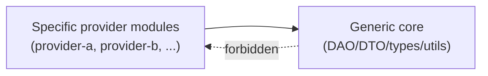

# Engineering Standards (Canonical)

These are the global engineering standards that apply to **every** codebase, language, and stack. The Cursor User Rules and the personal `engineering-standards` skill both point at this file. Update this single document; do not duplicate the rules.

> **Definition of Done:** every item in the [Pre-completion checklist](#pre-completion-checklist) passes before claiming any task as complete, before committing, and before opening a pull request.

---

## The 17 standards

### 1. Flat control flow — no nested `if`/`else` or `try`/`catch`

- Maximum **one** level of conditional nesting inside any function. If you need more, extract a named helper.
- Prefer **early returns** and **guard clauses** over `else` branches.
- Never wrap a `try`/`catch` inside another `try`/`catch`. Catch at one place per logical unit, then return or rethrow a domain-specific error.
- A `try` block should contain the **single** operation that can throw; surrounding setup, mapping, and follow-up calls live outside it.

```ts
// BAD — nested branches and stacked try/catch
async function pay(user) {
  if (user) {
    try {
      const acct = await fetchAccount(user.id);
      if (acct) {
        try {
          return await charge(acct);
        } catch (e) {
          if (e.code === "DECLINED") {
            return { ok: false };
          } else {
            throw e;
          }
        }
      }
    } catch (e) {
      log(e);
    }
  }
}

// GOOD — guards + single try/catch + helpers
async function pay(user: User): Promise<PayResult> {
  if (!user) return PayResult.invalidUser();
  const account = await fetchAccount(user.id);
  if (!account) return PayResult.accountMissing();
  return chargeAccount(account);
}

async function chargeAccount(account: Account): Promise<PayResult> {
  try {
    return PayResult.ok(await charge(account));
  } catch (error) {
    if (isDeclined(error)) return PayResult.declined();
    throw new PaymentError("charge failed", { cause: error });
  }
}
```

### 2. Code is read more than it is written

- Names describe intent in the domain language, not the mechanism.
- Functions do **one** thing; their name reads like the sentence the caller would write.
- Keep files focused. Split when responsibilities diverge; never split arbitrarily by layer.
- Prefer straight-line code with descriptive locals over clever expressions.

### 3. Reuse existing constants, types, DTOs, DAOs, and utilities

Before writing anything new:

1. Search the workspace for an existing constant, enum, type, DTO, schema, helper, or DAO that already expresses the value or behavior.
2. If something close exists, **extend** it (or its module) rather than reimplementing.
3. Only introduce a new symbol when nothing fits — and place it in the canonical module for that concern.

Hard-coded literals that mirror an existing constant are a defect.

### 4. Define types/constants/DTOs/DAOs in their canonical files

- Constants live in the dedicated `*.constants.*` (or equivalent) file for the module.
- Interfaces and types live in `*.types.*` / `*.interfaces.*` or the module's `dto/` folder.
- DAOs / repositories live in `dao/` (or `repository/`); controllers/handlers never inline DAO logic.
- No string/number literals leaking into business logic when a typed constant exists.

**Do not spawn a new file per flow / use-case / fix.** A module owns one canonical `*.constants.*`, one `*.types.*` (or `*.interfaces.*`), and one `dto/` folder per concern. When a new flow needs a constant, type, or DTO, **extend the existing canonical file** for that module — do not create a parallel file named after the flow. Names like `<feature>-status-resolution.constants.ts`, `<feature>-webhook.types.ts`, or `<provider>-status-resolution.types.ts` placed next to an existing canonical owner are anti-patterns: they fragment the module's surface area and make reuse harder. Split a file only when responsibilities have genuinely diverged into a different module-level concern, not because a new flow, fix, or use case was added.

Before creating any new `*.constants.*` / `*.types.*` / `dto/*` file, list every file in the target module's `constants/`, `types/`, and `dto/` directories. If a canonical owner for the concern already exists, extend it. Creating a new file is a defect when the existing canonical file is the right home.

#### Test file naming (1:1 with source)

The same anti-proliferation rule applies to unit-test files. A unit-test file mirrors the source file it exercises, one-to-one:

- Name a unit-test file after the source file it tests (`<source-file>.unit.test.ts` for the source `<source-file>.ts`); place it under the `__tests__/` mirror of the source path. The same convention applies in other languages (`<source-file>_test.go`, `test_<source-file>.py`, `<SourceFile>Test.java`, etc.).
- Do **not** create a separate test file per class, per method, per use case, or per flow within a single source module. Names like `<provider>-external-account.dao.unit.test.ts` and `<provider>-payment-intent-enhancer.unit.test.ts` placed next to a source file `<provider>-provider.dao.ts` are the same anti-pattern as a per-flow `*.constants.*` split — fragmenting one module's tests across multiple files makes mocks duplicate, fixtures drift, and the canonical test surface unclear.
- Use sibling `describe(...)` (or the language's equivalent grouping) blocks **inside** the canonical test file to group cases by class, method, or scenario. One source file → one test file → many `describe` blocks.

Apply this rule retroactively when touching a source module that already has split per-class / per-flow test files: consolidate them into the canonical `<source-file>.unit.test.ts` (deduplicating mocks and fixtures) as part of the change. Do not add another sibling next to the existing splits — that compounds the violation.

### 5. Zero code smell in touched code

- Remove duplication, dead code, magic numbers, oversized functions, and long parameter lists in any file you modify (boy-scout rule limited to the touched scope, not unrelated files).
- Run the project's lint/format/type checker for the file before declaring done.
- No commented-out code. No `console.log` / `print` left behind.

### 6. Re-review every implementation against the plan

- Open the plan/spec immediately before claiming done. For each step, verify the diff actually delivers it.
- Walk the diff at least once focused **only** on adversarial cases (null, empty, large, malformed input; concurrent calls; partial failures).
- If the plan changed during implementation, update it in the same PR.

### 7. No legacy or backward-compatibility code unless explicitly requested

- Do not add feature flags, dual code paths, fallbacks, deprecated wrappers, or "for old clients" branches unless the spec calls for them.
- When refactoring, **remove** the old path; do not leave it side-by-side.
- Migration scripts are fine when the spec asks for them; runtime compat shims are not.

### 8. Tests are part of the change

- Every behavior change updates or adds tests in the same change set. Coverage of the touched module must not decrease.
- Add unit tests for new logic; integration/e2e tests for new wiring; regression tests for any bug fix.
- Run the full test suite for the affected package(s) before marking complete and capture the result.

### 9. Generic flows must not depend on specific providers/services

- Generic DAOs, DTOs, services, controllers, and utilities **must not import** from a specific provider or feature module.
- Specific providers may import generic code. The dependency arrow always points from specific → generic.
- Provider-specific behavior is injected (interface implementation, strategy, registry), not branched on inside generic code.



### 10. Respect module hierarchy; keep logic nuclear within a module

- A module owns its types, constants, and helpers. Other modules consume the public surface, not internal fields.
- Do not reach across modules to grab fields, schemas, or constants — re-export from the owning module or move the symbol if shared.
- New logic belongs in the **lowest** module that owns the data it operates on.

### 11. Strict typing — no `any`, no loose `Record`, no untyped objects

- TypeScript: ban `any`, `unknown`-as-pass-through, `object`, `Record<string, unknown>`, `Record<string, string>` for anything that has a known shape. Define an `interface` / `type` (or Joi/Zod schema) and use it.
- Function parameters and returns are always explicitly typed.
- DTOs and API payloads have a single source of truth (schema → inferred type), used on both sides of the boundary.
- Same principle in other languages: no untyped maps, no `interface{}` (Go), no `dynamic` (Dart), no `Any` (Python) where a model is known.

### 12. Layered import direction (parent → child only)

- Outer reusable layers (`src/types`, `src/dao`, `src/dto`, `src/constants`, `src/utils`, or the equivalents in your project) **MUST NOT** import from inner service / domain modules (`src/<domain-a>`, `src/<domain-b>`, …). The dependency arrow goes service/domain → infrastructure, never the reverse.
- Only inner service/domain modules import from outer layers. A service-domain symbol (an enum like `<Domain>Status`, a service-specific DTO, a registry, a polymorphic dispatcher that knows about service domain types) **belongs in the inner module that owns the domain**, not in the outer reusable layers.
- Provider-specific code that needs domain types lives in `src/<domain>/<domain>-providers/` (the inner provider sub-module), not in `src/dao/<domain>-gateways/`. Outer-layer DAOs stay generic; per-provider semantics dispatch through an inner-layer registry.
- This is a structural invariant: the parent (outer reusable infrastructure) cannot import from its children (inner service modules), exactly as a parent class cannot reference its subclasses by concrete name.
- Verify with this command before claiming any task done. **Any non-empty result that is not on the project's known-debt list is a violation:**

```bash
rg "from '\.\./\.\./<inner-module>/" src/types src/dao src/dto src/constants src/utils
```

Adapt the inner-module path (`payment`, `treasury`, `auth`, …) and outer-layer paths for the codebase being audited. Workspace-level rules in `.cursor/rules/` may pin the exact paths and known-debt list for that repo.

---

## OOP fundamentals

These principles apply at the class / module / function level. They are pre-requisites to the SOLID standards (13–17) and the design patterns appendix.

- **Encapsulation** — private state, public behaviour. No mutable public fields. Accessors only when they have a reason to exist beyond mirroring state.
- **Abstraction** — interfaces describe intent, not mechanism. `IPaymentGateway.charge()`, not `IPaymentGateway.callStripeApi()`. The caller never knows or cares which provider sits behind the interface.
- **Polymorphism, not type checks** — no `if (x instanceof Y)`, no `switch (x.type)`, no `if (provider === 'X')` in business logic. Either the type system is wrong, or the polymorphism is missing. Both are defects.
- **Composition over inheritance** — favour `class A { constructor(b: B) {} }` over `class A extends B`. Inheritance is reserved for framework-mandated bases (extending `Error`, `EventEmitter`, an ORM `Model`). New behaviour ships as a collaborator that is injected, not as a subclass.
- **Tell, don't ask** — call methods on objects to do things; do not ask for state and decide externally. `account.charge(amount)`, not `if (account.balance > amount) { account.balance -= amount; }`.
- **Law of Demeter** — talk to your immediate collaborators, not their internals. `a.b.c.d.method()` is a defect; either move the method onto `a`, expose a delegate on `a`, or restructure.
- **Single level of abstraction within a function** — do not mix high-level orchestration calls with low-level loops in the same function body. Extract the low-level work to a helper named after its intent.

---

### 13. SRP — single reason to change

Every class, module, and function has **one** responsibility. If you can name two unrelated reasons it would change, split it.

- Name the responsibility in **one sentence**. If the sentence requires "and", the responsibility is multiple.
- A 600-line `UserService` that handles authentication, profile updates, KYC, and notifications is four classes pretending to be one. Split.
- A function that fetches data, transforms it, and writes it back is three concerns. Split.

```ts
// BAD — two reasons to change: payment routing AND audit logging
class PaymentService {
  charge(account: Account, amount: Money): Receipt {
    const provider = this.pickProvider(account);
    const receipt = provider.charge(amount);
    this.auditLog.write({ accountId: account.id, amount, receiptId: receipt.id });
    return receipt;
  }
}

// GOOD — one responsibility per class; audit composed in
class PaymentService {
  constructor(private chooser: ProviderChooser, private auditor: PaymentAuditor) {}
  charge(account: Account, amount: Money): Receipt {
    const provider = this.chooser.for(account);
    const receipt = provider.charge(amount);
    this.auditor.record(account, amount, receipt);
    return receipt;
  }
}
```

---

### 14. OCP — open for extension, closed for modification

New variants extend by **registering a strategy** or **implementing an interface**, not by editing a `switch` chain. The dispatcher is closed; the registry is open.

- Adding a new payment provider, event type, validator, or rule should not require editing the dispatcher's source. It should require adding a new file that registers the strategy.
- The dispatcher iterates over the registry; the registry is the extension point.

```ts
// BAD — every new provider edits the same switch
function charge(provider: string, amount: Money): Receipt {
  switch (provider) {
    case "stripe": return chargeStripe(amount);
    case "paypal": return chargePayPal(amount);
    case "wise":   return chargeWise(amount);
    // adding a new provider requires editing this file
  }
}

// GOOD — registry is open, dispatcher is closed
const providerRegistry = new Map<ProviderId, IPaymentProvider>();
export function registerProvider(id: ProviderId, p: IPaymentProvider): void {
  providerRegistry.set(id, p);
}
export function charge(id: ProviderId, amount: Money): Receipt {
  const provider = providerRegistry.get(id);
  if (!provider) throw new UnknownProviderError(id);
  return provider.charge(amount);
}
```

---

### 15. LSP — substitutability contract

Every implementation of an interface honours the **preconditions, postconditions, and invariants** of the interface contract.

- A subtype must accept everything the supertype accepts (no strengthened preconditions).
- A subtype must produce everything the supertype produces (no weakened postconditions).
- A subtype must not throw error types the supertype does not declare.
- If `Square extends Rectangle` breaks `setWidth` / `setHeight` semantics, it violates LSP — that is the textbook example.

A common project-shaped violation: an interface declares `find(id): Account | null` and one implementation throws on missing instead of returning `null`. The caller cannot safely substitute one impl for another. Fix by either honouring the `null` contract or changing the interface.

---

### 16. ISP — small, role-specific interfaces

Prefer many small interfaces (`Reader<T>`, `Writer<T>`, `Hasher`, `Cache<T>`) over a god interface (`Repository` with thirty methods). A consumer never depends on methods it does not use.

- A read-only consumer should depend on `Reader<T>`, not on a full repository. Then a stub `Reader` is a one-method class instead of a thirty-method shim.
- When two unrelated callers each need different subsets of a fat interface, the interface is two interfaces wearing one mask. Split.

```ts
// BAD — every consumer transitively depends on every method
interface AccountRepository {
  find(id: Id): Account | null;
  insert(a: Account): void;
  update(a: Account): void;
  delete(id: Id): void;
  search(q: Query): Account[];
  exportCsv(): string;
  reindex(): void;
}

// GOOD — role-specific ports, each consumer depends only on what it uses
interface AccountReader   { find(id: Id): Account | null; search(q: Query): Account[]; }
interface AccountWriter   { insert(a: Account): void; update(a: Account): void; delete(id: Id): void; }
interface AccountIndexer  { reindex(): void; }
interface AccountExporter { exportCsv(): string; }
```

---

### 17. DIP — depend on abstractions

High-level modules (services, controllers, use-cases) depend on **interfaces**, not concrete classes. Concrete classes are wired at the **composition root** (DI container, factory, registry, application bootstrap).

- The dependency arrow at compile time always points at the abstraction.
- Concrete wiring happens once, at the edge — not scattered through the call graph.
- A service that imports `StripeProvider` directly is coupled to Stripe. A service that depends on `IPaymentProvider` and is wired with a Stripe instance at boot is decoupled.

```ts
// BAD — high-level service hard-codes the concrete provider
import { StripeProvider } from "./providers/stripe";
class PaymentService {
  charge(amount: Money): Receipt { return new StripeProvider().charge(amount); }
}

// GOOD — service depends on the abstraction; wiring lives at the composition root
class PaymentService {
  constructor(private provider: IPaymentProvider) {}
  charge(amount: Money): Receipt { return this.provider.charge(amount); }
}
// composition root (e.g. src/app.ts):
//   const paymentService = new PaymentService(new StripeProvider(stripeConfig));
```

DIP composes with rule 9 (generic must not depend on specific) and rule 12 (layered import direction). Together they say: the dependency arrow points up the abstraction ladder and from inner domain to outer infrastructure, never the reverse.

---

## Design patterns catalogue

The patterns below are tools, not trophies. Each entry names when to reach for it, when to stay away, the anti-pattern it fixes, and the standards it composes with. Apply only when a named anti-pattern in the touched code justifies the pattern; never apply a pattern because it sounds senior.

### Strategy

- **Use when**: a behaviour has multiple interchangeable implementations selected at runtime (payment provider, validator, formatter).
- **Avoid when**: there is exactly one implementation and no foreseeable second; YAGNI.
- **Fixes**: `switch (type)` chains in business logic.
- **Composes with**: 14 (OCP), 17 (DIP), 9 (generic-to-provider direction).

### Factory

- **Use when**: object construction is non-trivial (validation, default selection, parameter normalisation) and would otherwise duplicate at every call site.
- **Avoid when**: `new Foo(args)` is sufficient; do not wrap a one-liner.
- **Fixes**: scattered construction logic; partially-constructed objects.
- **Composes with**: 13 (SRP — construction is its own responsibility).

### Abstract Factory

- **Use when**: a family of related objects must be constructed together (a tenant gets a matched repository, cache, and event bus).
- **Avoid when**: only one product family exists; an abstract factory of one is dead weight.
- **Fixes**: cross-product mismatches (a v1 cache wired with a v2 repository).

### Registry

- **Use when**: a generic dispatcher must look up an implementation by key (provider id, event type, route).
- **Avoid when**: the implementations are bounded and fixed; a literal `Map` populated at module load is already a registry.
- **Fixes**: `switch` chains; the open/closed violation in standard 14.
- **Composes with**: 14 (OCP), 17 (DIP).

### Repository

- **Use when**: a domain object needs persistence and the domain layer should not know about the storage engine.
- **Avoid when**: the storage IS the model (raw analytics events streamed to a sink); a repository there is ceremony.
- **Fixes**: SQL bleeding into services; difficulty swapping or mocking storage.
- **Composes with**: 12 (layered imports), 16 (ISP — split read/write repositories).

### Adapter

- **Use when**: an existing third-party API does not match the interface the domain expects, and the third party cannot be changed.
- **Avoid when**: the third-party API is already a clean fit; an adapter that simply re-exports methods is noise.
- **Fixes**: domain code shaped by vendor APIs.

### Decorator

- **Use when**: cross-cutting behaviour (logging, retries, caching, metrics) must wrap an existing implementation without changing it.
- **Avoid when**: the cross-cutting behaviour belongs inside the implementation; a decorator that captures only one method is often better as a higher-order function.
- **Fixes**: cross-cutting concerns leaking into business code.
- **Composes with**: 13 (SRP), 17 (DIP).

### Observer (caveats)

- **Use when**: in-process loose coupling between a producer and many consumers within the **same process**.
- **Avoid when**: the consumers live in another process or service. Use Kafka / a message bus / an outbox; do not reinvent pub-sub with `EventEmitter` across processes.
- **Fixes**: hard-wired notifications inside a process.

### Builder

- **Use when**: an object has many optional fields and constructors with optional parameters become unreadable.
- **Avoid when**: a record with named arguments / object destructuring is sufficient; that is the language's built-in builder.
- **Fixes**: telescoping constructors.

### Template Method

- **Use when**: a sequence of steps is fixed but specific steps vary by subtype, AND inheritance is the natural fit (rare).
- **Avoid when**: the variation can be expressed by composition (Strategy), which is almost always the case.
- **Fixes**: duplicated step sequences across subtypes.
- **Caveat**: prefer Strategy unless the language or framework makes inheritance the path of least resistance.

### Chain of Responsibility

- **Use when**: a request must pass through ordered handlers (validators, request middlewares, rule pipelines), each able to handle, transform, or pass on.
- **Avoid when**: order does not matter or only one handler ever fires; that is just dispatch.
- **Fixes**: nested `if`/`else` rule chains.
- **Composes with**: 1 (flat control flow), 14 (OCP).

### Specification

- **Use when**: complex domain predicates need to be combined (`AND`, `OR`, `NOT`) and reused across query, validation, and authorisation.
- **Avoid when**: the predicate is one place, one usage; inlining is clearer.
- **Fixes**: predicate duplication; bespoke per-call validation.

### Result / Either

- **Use when**: a function has an **expected** failure mode that is part of its contract (validation failed, balance insufficient, idempotency replay).
- **Avoid when**: the failure is exceptional and unrecoverable (DB down, OOM); use exceptions there.
- **Fixes**: using exceptions for control flow; callers forgetting to handle expected failures.
- **Composes with**: 1 (flat control flow — no exception-based branching for expected outcomes), 11 (strict typing — the failure type is part of the signature).

---

## Pre-completion checklist

Run through this list **before** saying "done", committing, or opening a PR. If something fails, fix it; do not narrate around it.

- [ ] Control flow stays flat — no nested `if`/`else`, no nested `try`/`catch`, guard clauses used.
- [ ] No new hard-coded values that already exist as constants or enums.
- [ ] New constants/types/DTOs/DAOs live in their canonical files; nothing inlined.
- [ ] Any new `*.constants.*` / `*.types.*` / `dto/*` file represents a genuinely new module-level concern, not a per-flow split alongside an existing canonical owner.
- [ ] Test files follow the 1:1 naming rule (one `*.unit.test.ts` per source file, named after the source file; no per-class, per-method, or per-flow splits — use `describe(...)` blocks inside the canonical test file instead).
- [ ] No `any`, no untyped maps, no loose `Record<...>` where a real type exists; explicit signatures on all public functions.
- [ ] Generic code does not import from any specific provider/service module.
- [ ] Outer layers (`src/types`, `src/dao`, `src/dto`, `src/constants`, `src/utils`) do not import from inner service modules. Verify with `rg "from '\.\./\.\./<inner-module>/" src/types src/dao src/dto src/constants src/utils` for every inner module touched. Any new entry beyond the project's documented known-debt list is a violation.
- [ ] No new legacy/back-compat shim, dead code, commented-out code, or stray logs.
- [ ] Diff matches the plan; adversarial walk-through done (null, empty, error, concurrent, partial-failure paths).
- [ ] Tests added/updated for every behavior change; coverage for touched modules not lower than before.
- [ ] Lint, type-check, and the relevant test suite all run **and pass**; output captured.
- [ ] Plan/spec updated if the implementation diverged.
- [ ] Each new class / module names its single responsibility in one sentence (SRP, standard 13).
- [ ] No new `switch (type)` or `if (provider === 'X')` branches in business logic — new variants registered as strategies (OCP, standard 14).
- [ ] No new `instanceof` checks in business logic — polymorphism used instead (OOP fundamentals).
- [ ] No new public mutable fields — state encapsulated (OOP fundamentals).
- [ ] No new inheritance chain (apart from framework-mandated bases like `Error` or `EventEmitter`) — composition used instead (OOP fundamentals).
- [ ] All new high-level modules depend on interfaces, not concrete classes (DIP, standard 17); concrete wiring lives at the composition root.
- [ ] Each new interface is role-specific (ISP, standard 16); no new god interfaces.
- [ ] Every implementation of an existing interface preserves the contract (LSP, standard 15) — no weakened preconditions, no thrown error types undeclared in the interface contract.

---

## How agents should use this document

1. At the start of any implementation, fix, refactor, design, or review task, **read this file** and surface the checklist in your plan/todos.
2. When writing a plan, copy the relevant items into the plan's Non-Functional Requirements section.
3. When reviewing your own diff before completion, run the checklist explicitly and report each item's status.
4. If a standard genuinely cannot be met for a task, call it out explicitly with a reason — do not silently skip.

## Companion documents

- [`~/.cursor/scalable-backend-design.md`](scalable-backend-design.md) — universal scalable-backend system-design primitives (idempotency, transactional outbox, idempotent consumers, circuit breakers, bulkheads, backpressure, retries, graceful shutdown, health checks, observability). Read alongside this doc when designing or implementing backend services.
- [`~/.cursor/skills/engineering-standards/SKILL.md`](skills/engineering-standards/SKILL.md) — auto-trigger skill that surfaces this checklist on coding tasks.
- [`~/.cursor/skills/scalable-system-design/SKILL.md`](skills/scalable-system-design/SKILL.md) — auto-trigger skill that walks new designs through the 7-step questionnaire.
- Workspace-level rules under `<repo>/.cursor/rules/*.mdc` and skills under `<repo>/.cursor/skills/<name>/SKILL.md` may pin project-specific paths, tech-stack rules, and known-debt entries; the workspace copy wins on conflicts within that repo.
